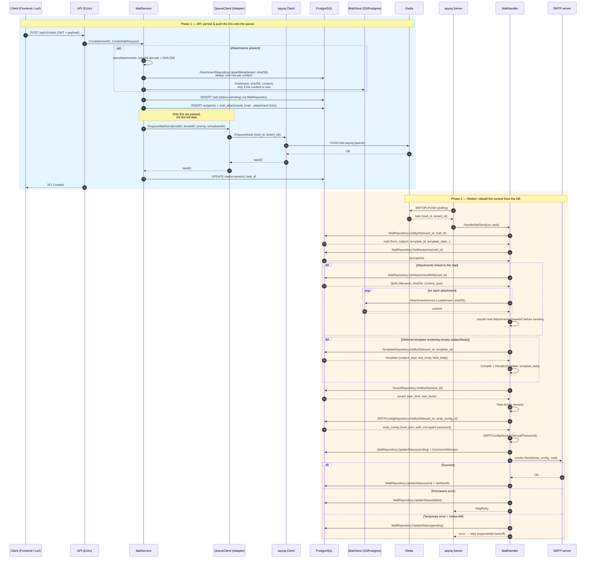

# MailHive

[](https://github.com/statoon54/mailhive/actions/workflows/ci.yml)
[](https://github.com/statoon54/mailhive/releases)
[](https://github.com/statoon54/mailhive)
[](LICENSE)

[Français](README.md) · **English**

Multi-tenant platform for sending and managing emails, with an asynchronous queue, embedded templates, SMTP encryption and a real-time dashboard.

Built as part of the MailHive project.


---

## Table of contents

- [Features](#features)
- [Architecture](#architecture)
- [Tech stack](#tech-stack)
- [Docker infrastructure](#docker-infrastructure)
- [Installation](#installation)
- [Configuration](#configuration)
- [Usage](#usage)
- [REST API](#rest-api)
- [Database](#database)
- [Frontend](#frontend)
- [Internationalization (i18n)](#internationalization-i18n)
- [AI content generation](#ai-content-generation)
- [Make commands](#make-commands)
- [License](#license)

---

## Features

### Multi-tenancy

- Each tenant has its own isolated space (mails, templates, SMTP configs)
- Unique API key per tenant for authentication
- Per-tenant settings: rate limit, burst, maximum number of recipients
- Tenant activation/deactivation by the administrator

### Email sending

- Asynchronous sending via a Redis/Asynq queue (3 priority levels: critical, default, low)
- Multiple recipients (to, cc, bcc)
- Text and HTML bodies
- Attachments — content-addressed and **deduplicated per tenant** (stored once, referenced N times), in PostgreSQL or an S3-compatible object store
- Scheduled delivery (`scheduled_at`) with flexible formats (RFC3339, datetime, date)
- Custom per-mail metadata
- Status tracking: `pending` → `queued` → `sending` → `sent` | `failed` | `cancelled`
- Cancel pending mails and retry failed ones

### Email templates

- Reusable templates with variables (Go `{{.Variable}}` syntax)
- Built-in HTML editor: edit the raw HTML source with a live preview (iframe) and a source/preview toggle
- Server-side HTML sanitization (bluemonday) before storage and sending
- AI-assisted content generation (see [AI content generation](#ai-content-generation))
- Preview with test data
- Unique slug per tenant for easy referencing

### SMTP configurations

- Multiple SMTP configs per tenant with a default config
- Authentication methods: PLAIN, LOGIN, CRAM-MD5, NONE
- TLS policies: mandatory, opportunistic, none
- Passwords encrypted with AES-GCM in the database
- Built-in SMTP connection test

### Branding

- Customizable application title and subtitle
- Logo upload (PNG, JPEG, SVG)
- Configurable timezone (for dates without a timezone)
- UI language selector (French / English)
- Contextual tooltips on every form field

### Queue and workers

- Asynq workers with configurable concurrency (default: 50 goroutines)
- 3 weighted-priority queues (critical:6, default:3, low:1)
- Automatic retry with exponential backoff (max 5 attempts)
- Per-SMTP-config circuit breaker (5 failures → open, 30s cooldown → half-open)
- Distributed per-tenant rate limiting via a **Redis token bucket** (atomic Lua script)

### Rate limiting — Redis token bucket

Rate control uses a **token bucket** algorithm implemented in Redis via an **atomic Lua script**, applied on the worker side at actual send time. Each tenant has a Redis hash (`rate_limit:{tenantID}`) holding the token count and the last-access timestamp; the Lua script computes accrued tokens, consumes one if available, and sets a safety TTL. The approach is **distributed**: multiple worker instances share the same rate-limiting state through Redis.

With the default configuration (`rate_limit=10`, `rate_burst=20`):

| Situation | Result |
| ----------- | ---------- |
| 10 mails in 1 second | All pass (normal rate) |
| 20 mails at once | All pass (burst absorbs the spike) |
| 25 mails at once | 20 pass, 5 rescheduled by Asynq |
| 5s of silence then 20 mails | All pass (bucket refilled to capacity) |

### Real-time monitoring

- Dashboard with statistics from PostgreSQL (mail statuses)
- Real-time Asynq queue monitoring (adaptive polling: 2s while a send is in progress, 15s when idle, paused when the tab is hidden)
- Per-queue metrics: active, pending, scheduled, retry, archived tasks, latency
- Per-tenant statistics (sent, pending, failed)
- Interactive charts (bar, pie) via Recharts

### Security

- Stateless JWT authentication with token refresh
- Admin access-control middleware
- Per-tenant data isolation (tenant_id in every query)
- AES-GCM encryption of SMTP passwords
- Server-side HTML sanitization of templates (bluemonday)
- SQL injection protection (parameterized pgx queries)
- Unique request ID (X-Request-ID) for traceability

### Audit log

- Full traceability of actions (create, update, delete, test, cancel, retry)
- Filtering by resource type and status
- Enriched audit details (recipients, subject, truncated body)
- Monthly PostgreSQL partitioning for performance

---

## Architecture

The project follows a **hexagonal architecture** (ports & adapters) with a strict separation of concerns: `internal/{domain,port,service,adapter,handler,worker}`. The single binary embeds the React frontend via `go:embed` and runs the API, the worker, and the migrations.

### Mail sending flow



---

## Tech stack

| Component | Technology | Version |
| ----------- | ------------- | --------- |
| **Backend** | Go | 1.26 |
| **HTTP framework** | Echo | v5 |
| **Database** | PostgreSQL | 18 |
| **DB driver** | pgx | v5 |
| **Cache & queue** | Valkey (Redis-compatible) | 8 |
| **Job queue** | Asynq | v0.26 |
| **Object store (attachments)** | S3-compatible (SeaweedFS/MinIO/S3/R2) via minio-go | v7 |
| **Frontend** | React + TypeScript | 19 / 6 |
| **Bundler** | Vite (Rolldown) | 8 |
| **CSS** | Tailwind CSS | v4 |
| **HTML editor** | In-house component (source + iframe preview) | — |
| **HTML sanitization** | bluemonday (backend) | v1.0 |
| **Frontend i18n** | react-i18next + i18next | 17 / 26 |
| **Backend i18n** | Internal `internal/i18n` package | — |
| **Charts** | Recharts | 3 |
| **Router** | React Router | v7 |
| **HTTP client** | Axios | 1.x |

---

## Docker infrastructure

The app ships as a **single binary** embedding the React frontend (`go:embed`). The base stack runs `mailhive` + `postgres` + `redis`; the `dev` profile adds `mailpit` (test SMTP) and `seaweedfs` (local S3).

| Service | Image | Port | Role |
| --------- | ------- | ------ | ------ |
| **mailhive** | Multi-stage build (Node + Go) | 8080 | REST API + Worker + SPA frontend |
| **postgres** | postgres:18-alpine | 5432 | Main database |
| **redis** | valkey/valkey:8-alpine | 6379 | Cache + queue backend |
| **mailpit** | axllent/mailpit | 1025 / 8025 | Test SMTP server (`dev` profile only) |
| **seaweedfs** | chrislusf/seaweedfs | 8333 (S3) / 8888 (filer) | Local S3 object store to test `BLOB_BACKEND=s3` (`dev` profile only) |

### Binary subcommands

```bash
mailhive serve          # API + Worker (default)
mailhive api            # API only
mailhive worker         # Worker only
mailhive migrate        # Apply migrations
mailhive migrate-down   # Roll back the last migration
mailhive version        # Print the version
```

### Attachment storage (S3 / SeaweedFS)

Attachment content is **content-addressed** (key = SHA-256) and **deduplicated per tenant**: the same file sent to N recipients is stored only once. The backend is chosen via `BLOB_BACKEND`:

- `postgres` (default): content in the `attachment_blobs` table;
- `s3`: content in an S3-compatible object store (SeaweedFS, MinIO, AWS S3, R2).

To test the S3 backend locally, a **SeaweedFS** instance is provided under the `dev` profile:

```bash
make docker-dev-s3   # dev stack + SeaweedFS, BLOB_BACKEND=s3
```

Objects are stored in the `mailhive-attachments` bucket under the key `<tenant_id>/<sha256-hex>` (one object per unique content). Inspect them via the filer HTTP endpoint (`http://localhost:8888/buckets/mailhive-attachments/`) or any S3 client pointed at `:8333` with the credentials from `docker/seaweedfs/s3.json`.

---

## Installation

### Prerequisites

- Docker and Docker Compose
- (Optional, for dev) Go 1.26+, Node.js 24+, Make

### Quick start

```bash
git clone <repo-url>
cd mailhive
cp .env.example .env

# Start the 3 services (mailhive + postgres + redis)
docker compose up --build -d

# With Mailpit (test SMTP server) for development
docker compose --profile dev up --build -d

docker compose logs -f
```

The app is available at:

- **Frontend + API**: <http://localhost:8080>
- **REST API**: <http://localhost:8080/api/v1>
- **Swagger UI**: <http://localhost:8080/swagger/>
- **Mailpit** (dev profile): <http://localhost:8025>

### Local development (without Docker)

```bash
cp .env.example .env   # set DB_HOST=localhost, REDIS_ADDR=localhost:6379
make run               # API + Worker (unified binary)

cd frontend && npm install && npm run dev   # Vite dev server on :5173

make build             # build frontend then Go binary (with embed)
```

### Production deployment

`docker-compose.prod.yml` runs the **published image** (GHCR) instead of building from source, with attachments on **S3** (self-hosted SeaweedFS by default). It is standalone (do not combine with `docker-compose.yml`).

```bash
# Provide secrets via a .env file (or the environment)
MAILHIVE_TAG=0.1.0 docker compose -f docker-compose.prod.yml up -d
# or: make docker-prod
```

> The image tag follows semver **without the `v` prefix** (`0.1.0`, `0.1`, `latest`),
> unlike the git tag (`v0.1.0`).

`JWT_SECRET`, `ENCRYPTION_KEY` (64 hex), `ADMIN_API_KEY` and `DB_PASSWORD` are **required** (startup fails otherwise). Migrations run automatically. Only port `8080` is exposed. For an external S3 (AWS S3, R2, managed MinIO), set `BLOB_S3_ENDPOINT` + credentials and remove the `seaweedfs` service and its dependency.

### Without Compose (existing services)

The image contains **only the application** (single binary: API + worker + embedded frontend) — it provides neither a database, nor a queue, nor an object store. Compose is just a convenient way to wire everything; the image runs against any reachable services (managed, Kubernetes, `docker run`…).

| Service | Required | Role | Alternatives |
| --- | --- | --- | --- |
| PostgreSQL | **yes** | data + migrations | any reachable Postgres |
| Redis / Valkey | **yes** | Asynq queue + rate limiting | any Redis-compatible server |
| S3 | only if `BLOB_BACKEND=s3` | attachment content | AWS S3, R2, MinIO… (default `postgres`: no S3) |

```bash
docker run -d -p 8080:8080 \
  -e DB_HOST=postgres.internal -e DB_PASSWORD=… \
  -e REDIS_ADDR=redis.internal:6379 \
  -e JWT_SECRET=… -e ENCRYPTION_KEY=… -e ADMIN_API_KEY=… \
  -e BLOB_BACKEND=postgres \
  ghcr.io/statoon54/mailhive:0.1.0
```

Only **PostgreSQL and a Redis-compatible server** are mandatory; an S3 object store is only needed with `BLOB_BACKEND=s3`. Migrations run at startup.

---

## Configuration

All variables are loaded from the environment (`.env` file):

| Variable | Default | Description |
| ---------- | -------- | ------------- |
| `API_HOST` | `0.0.0.0` | Listen address |
| `API_PORT` | `8080` | API server port |
| `DB_HOST` | `localhost` | PostgreSQL host |
| `DB_PORT` | `5432` | PostgreSQL port |
| `DB_USER` | `mailhive` | DB user |
| `DB_PASSWORD` | — | DB password |
| `DB_NAME` | `mailhive` | Database name |
| `DB_SSL_MODE` | `disable` | SSL mode (disable/require) |
| `DB_MAX_CONNS` | `50` | Max pool connections (should be ≥ `WORKER_CONCURRENCY`) |
| `REDIS_ADDR` | `localhost:6379` | Redis address |
| `REDIS_PASSWORD` | — | Redis password |
| `REDIS_DB` | `0` | Redis database |
| `JWT_SECRET` | — | JWT signing key (min 32 chars) |
| `JWT_EXPIRATION` | `24h` | Token validity |
| `ADMIN_API_KEY` | — | Administrator API key |
| `ENCRYPTION_KEY` | — | 32-byte hex key for SMTP encryption |
| `WORKER_CONCURRENCY` | `50` | Worker goroutines |
| `DEFAULT_RATE_LIMIT` | `100` | Mails/second per tenant |
| `DEFAULT_RATE_BURST` | `200` | Burst per tenant |
| `SMTP_MODE` | `real` | Send mode: `real` (real SMTP) or `simulation` (logs only) |
| `BLOB_BACKEND` | `postgres` | Attachment storage: `postgres` or `s3` |
| `BLOB_S3_ENDPOINT` / `BLOB_S3_BUCKET` / `BLOB_S3_ACCESS_KEY` / `BLOB_S3_SECRET_KEY` / `BLOB_S3_REGION` / `BLOB_S3_USE_SSL` | — | S3 settings (when `BLOB_BACKEND=s3`) |

### SMTP simulation mode

Set `SMTP_MODE=simulation` to test the API without a real SMTP server: mails are **not sent**, their details are logged by the worker, and the mail still moves to `sent`.

### Mailpit — test SMTP server

[Mailpit](https://github.com/axllent/mailpit) is bundled in the Docker stack (`dev` profile) as a test SMTP server: it captures all sent mail and offers a web UI (`:8025`) without ever delivering it. SMTP on `:1025` (no auth). On first start in `real` mode, MailHive auto-creates an admin tenant and a default Mailpit SMTP config if none exists.

### SMTP integration tests

Integration tests verify real sending through Mailpit (build tag `integration`, not run by `go test ./...`). A dedicated stack (`docker-compose.test.yml`) contains only Mailpit.

```bash
make docker-test-up    # start Mailpit
make test-smtp         # run SMTP integration tests
make docker-test-down  # stop Mailpit
```

---

## Usage

### Authentication

```bash
# Get a JWT (admin)
curl -X POST http://localhost:8080/api/v1/auth/token \
  -H "Content-Type: application/json" \
  -d '{"api_key": "admin-dev-key"}'

export TOKEN="eyJ..."
curl -H "Authorization: Bearer $TOKEN" http://localhost:8080/api/v1/mails/stats
```

### Send a mail

```bash
curl -X POST http://localhost:8080/api/v1/mails \
  -H "Authorization: Bearer $TOKEN" \
  -H "Content-Type: application/json" \
  -d '{
    "to": [{"email": "dest@example.com", "name": "Recipient"}],
    "subject": "MailHive test",
    "html_body": "<h1>Hello!</h1><p>Sent via MailHive.</p>"
  }'
```

### Schedule a deferred send

Add `scheduled_at` to the payload. Accepted formats: RFC3339 (`2026-03-10T09:00:00Z`), with offset (`...+02:00`), datetime with `T` or space (`2026-03-10 09:00:00`), or date only (`2026-03-10`).

### Web UI

Log in at <http://localhost:8080> with a tenant API key. The dashboard shows global stats, status/tenant charts, real-time queue monitoring, and the latest mails.

---

## REST API

**OpenAPI** specification: [`api/openapi.yaml`](api/openapi.yaml). It is also
served by the app at `/swagger/openapi.yaml`, with the Swagger UI at
<http://localhost:8080/swagger/>.

### Public routes

| Method | Endpoint | Description |
| --------- | ---------- | ------------- |
| POST | `/api/v1/auth/token` | Generate a JWT |
| POST | `/api/v1/auth/refresh` | Refresh a JWT |
| GET | `/api/v1/health` | Health check (DB + Redis) |

### Protected routes (JWT required)

#### Mails

| Method | Endpoint | Description |
| --------- | ---------- | ------------- |
| POST | `/mails` | Create and enqueue a mail |
| GET | `/mails` | List mails (pagination, status filter) |
| GET | `/mails/stats` | Tenant mail statistics |
| GET | `/mails/:id` | Mail detail with recipients and attachment metadata |
| GET | `/mails/:id/attachments/:attachmentId` | Download an attachment |
| POST | `/mails/:id/cancel` | Cancel a pending mail |
| POST | `/mails/:id/retry` | Retry a failed mail |

#### Templates & SMTP configs

CRUD under `/templates` and `/smtp-configs` (plus `/templates/:id/preview` and `/smtp-configs/:id/test`).

#### Administration (admin role)

CRUD under `/admin/tenants` (plus `/admin/tenants/:id/regenerate-key`), `/admin/stats/by-tenant`, and `/admin/queues`.

---

## Database

PostgreSQL schema, migrations applied automatically at startup:

| Table | Description |
| ------- | ------------- |
| `tenants` | Multi-tenant accounts (UUID, unique slug, API key, JSON settings) |
| `smtp_configs` | SMTP configs per tenant (AES-GCM encrypted password) |
| `mail_templates` | Email templates with variables (JSON) |
| `mails` | Email messages (status, attempts, scheduling) |
| `mail_recipients` | Recipients per mail (to/cc/bcc) |
| `attachments` | Attachment metadata, content-addressed and deduplicated per tenant (`tenant_id`, `sha256`) |
| `attachment_blobs` | Attachment content for the `postgres` backend (empty in `s3` backend) |
| `mail_attachments` | Mail → attachment links (per-mail filename) |
| `app_branding` | Application branding (title, logo, timezone, language) |
| `audit_logs` | Audit log, **monthly partitioned** |

The `mails` and `mail_recipients` tables have partitioned archive variants (`*_archive`).

---

## Frontend

React SPA served by the binary (embedded via `go:embed`) at <http://localhost:8080>; in development the Vite server runs on `:5173`:

| Page | Route | Description |
| ------ | ------- | ------------- |
| Login | `/login` | API-key authentication |
| Dashboard | `/` | Stats, charts and queue monitoring |
| Mails | `/mails` | Paginated list with status filters |
| Mail detail | `/mails/:id` | Details, recipients, attachments (with download) |
| Templates | `/templates` | CRUD + preview |
| SMTP configs | `/smtp-configs` | CRUD + connection test |
| Tenants | `/tenants` | Tenant management (admin) |

---

## Internationalization (i18n)

The frontend is fully internationalized via **react-i18next** with automatic browser-language detection:

- **Supported languages**: French (`fr`), English (`en`)
- **Detection**: `localStorage` → `navigator.language` → fallback `fr`
- **Translation files**: `frontend/src/i18n/fr.json`, `frontend/src/i18n/en.json`
- **Language selector** in the navigation bar

---

## AI content generation

The template editor includes an AI assistant to generate email HTML content from a natural-language prompt.

| Variable | Description | Default |
| --- | --- | --- |
| `LLM_PROVIDER` | LLM provider (`ollama` or `openai`) | `ollama` |
| `LLM_BASE_URL` | Provider API URL | `http://localhost:11434` |
| `LLM_MODEL` | Model to use | `llama3` |
| `LLM_API_KEY` | API key (required for OpenAI) | — |

`POST /api/v1/ai/generate` sends the prompt to the configured LLM, which returns inner HTML inserted into the editor (editable before saving).

---

## Make commands

```bash
make build             # Build frontend + Go binary (with embed)
make build-go          # Build the Go binary only
make run               # Run MailHive (API + Worker)
make test-unit         # Unit tests
make test-integration  # Integration tests (DB)
make test-smtp         # SMTP integration tests (Mailpit required)
make lint              # Linter (golangci-lint v2)
make migrate-up        # Run migrations
make docker-up         # docker compose up --build -d
make docker-dev        # Dev stack (Mailpit)
make docker-dev-s3     # Dev stack + SeaweedFS (attachments on S3)
make docker-prod       # Production stack (published image + S3)
```

---

## Author

- **Franck Paszkowski**
- contact: <statoon54@gmail.com>

---

## License

Distributed under the MIT License. See [LICENSE](LICENSE) for details.
